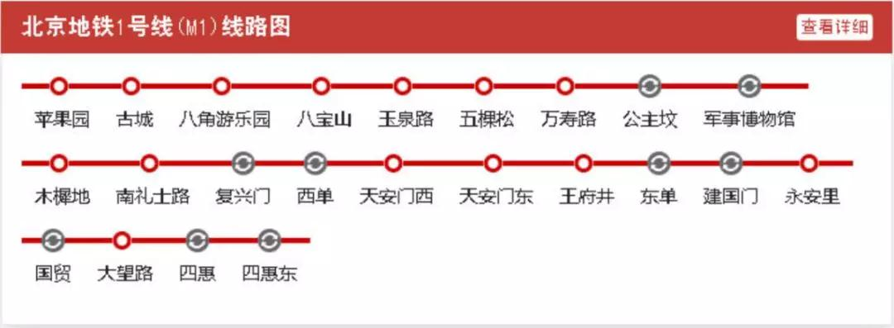

# 北京地铁

## 一号线

福寿岭

苹果园（本站可换乘<Badge text="地铁6号线" color="#BB8900" />与<Badge text="地铁S1号线" color="#9B4D1B" />）

古城 八角游乐园 八宝山 玉泉路 五棵松 万寿路 

公主坟（本站可换乘<Badge text="地铁10号线" color="#00AECE" />）

军事博物馆 木樨地 南礼士路 复兴门 西单 天安门西 天安门东 王府井 东单 建国门 永安里 国贸 大望路 四惠 四惠东 高碑店 传媒大学 双桥 管庄 八里桥 通州北苑 果园 九棵树 梨园 临河里 土桥 花庄 环球度假区

